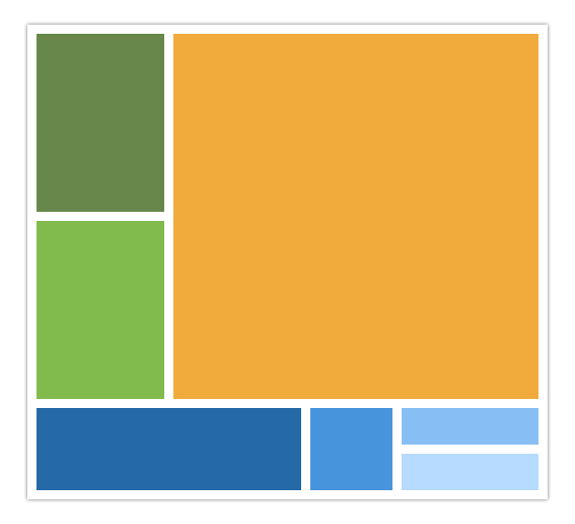

#THE BOX
This is a challenge to test your fundamental css & html skills. There are many ways to slice the pie, we want to see how you approach it.

### Criteria
* Reproduce the provided art `BOX-TEST-LAYOUT.png` (shown above) with html & css
* Color and sizing accuracy is important
* You **CANNOT** use images
* You **CAN** use javascript
* Code must be browser compatible w/ latest 3 releases of IE, Firefox, Chrome
* Graceful degradation is completely ok for unsupported browser features

### Bonus Points
* If you can "rock star" this and add creative flare / code, we'll notice (and encourage it).
